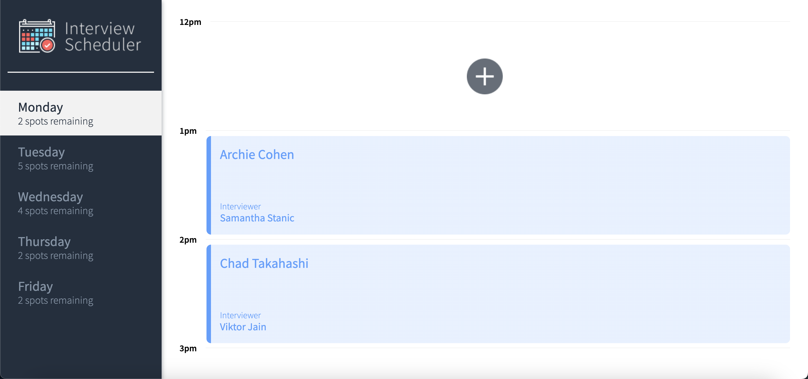
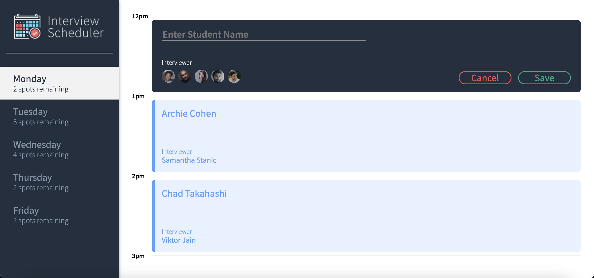
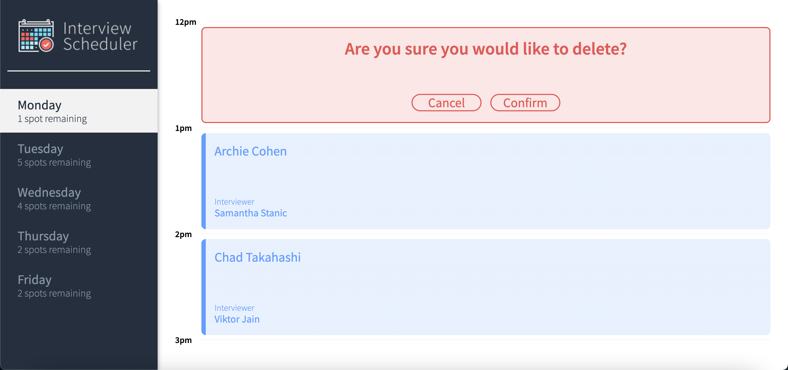

# Interview Scheduler
Interview Scheduler allows users to book, edit or cancel interview.

## Final product





## Setup

Install dependencies with `npm install`.

## Running Webpack Development Server

```sh
npm start
```

## Running Jest Test Framework

```sh
npm test
```

## Running Storybook Visual Testbed

```sh
npm run storybook
```
